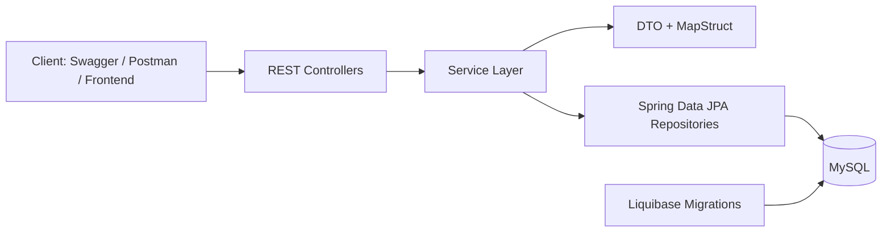

# Online Book Store API

An online bookstore backend built with Spring Boot. The project solves a common e-commerce flow end to end: users can register, browse a catalog, search by author or title, manage a shopping cart, and place orders, while admins can manage books, categories, and order statuses.

This repository is structured as a portfolio-ready REST API project. It demonstrates layered architecture, role-based access control, database versioning with Liquibase, and containerized local setup with Docker Compose.

## Contents

- [Project Overview](#project-overview)
- [Tech Stack](#tech-stack)
- [Architecture](#architecture)
- [Features](#features)
- [API Modules](#api-modules)
- [Demo Flow](#demo-flow)
- [Getting Started](#getting-started)
- [Authentication](#authentication)
- [Seed Data](#seed-data)
- [Testing](#testing)
- [Challenges and Decisions](#challenges-and-decisions)
- [Loom Demo](#loom-demo)

## Project Overview

The application exposes a REST API under `/api` and models the core bookstore domain:

- users and roles
- books and categories
- shopping carts and cart items
- orders and order items

It is designed around a standard Spring Boot service layout:

- controllers handle HTTP requests
- services contain business logic
- repositories encapsulate persistence
- DTOs and mappers isolate the API contract from JPA entities
- Liquibase manages schema creation and seed data

## Tech Stack

- Java 17
- Spring Boot 3.2.3
- Spring Web
- Spring Security
- Spring Data JPA
- Hibernate Validator
- MapStruct
- Liquibase
- MySQL
- H2 database for tests
- Swagger / SpringDoc OpenAPI
- Docker and Docker Compose
- Maven

## Architecture



## Features

- User registration and login
- Role-based access with `ROLE_USER` and `ROLE_ADMIN`
- Book CRUD operations
- Category CRUD operations
- Book search by title and author
- Shopping cart retrieval, add/update/remove cart items
- Order creation from shopping cart
- Order history and order item lookup
- Admin order status updates
- Database migrations and seed data with Liquibase
- Dockerized startup for the full app + MySQL stack

## API Modules

Base URL: `http://localhost:8080/api` when running through Docker Compose.

### Authentication Controller

- `POST /auth/registration` registers a new user
- `POST /auth/login` authenticates a user and returns a token response

### Book Controller

- `GET /books` returns paginated books
- `GET /books/{id}` returns a single book by id
- `GET /books/search` searches books by title and/or author
- `POST /books` creates a book (`ROLE_ADMIN`)
- `PUT /books/{id}` updates a book (`ROLE_ADMIN`)
- `DELETE /books/{id}` deletes a book (`ROLE_ADMIN`)

### Category Controller

- `GET /categories` returns all categories
- `GET /categories/{id}` returns one category
- `GET /categories/{id}/books` returns books in a category
- `POST /categories` creates a category (`ROLE_ADMIN`)
- `PUT /categories/{id}` updates a category (`ROLE_ADMIN`)
- `DELETE /categories/{id}` deletes a category (`ROLE_ADMIN`)

### Cart Controller

- `GET /cart` returns the authenticated user's shopping cart
- `POST /cart` adds a book to the cart
- `PUT /cart/cart-items/{id}` updates cart item quantity
- `DELETE /cart/cart-items/{id}` removes a cart item

### Order Controller

- `POST /orders` creates an order from the shopping cart
- `GET /orders` returns current user's orders
- `GET /orders/{orderId}/items` returns items for a specific order
- `GET /orders/{orderId}/items/{itemId}` returns a specific order item
- `PATCH /orders/{orderId}` updates order status (`ROLE_ADMIN`)
- `DELETE /orders/{orderId}` deletes an order (`ROLE_ADMIN`)

## Demo Flow

This is the simplest flow to show during an interview or Loom demo:

1. Register a new user or log in with seeded credentials.
2. Open Swagger UI and inspect available endpoints.
3. Fetch books and categories.
4. Add a book to the cart and update quantity.
5. Create an order from the cart.
6. Fetch order history and inspect order items.
7. As admin, update order status to `COMPLETED` or `DELIVERED`.

## Getting Started

### Option 1: Run with Docker Compose

This is the easiest setup because it starts both MySQL and the Spring Boot application.

1. Build the jar:

```powershell
mvn clean package
```

2. Start the containers:

```powershell
docker compose up --build
```

3. Open the application:

- API base path: `http://localhost:8080/api`
- Swagger UI: http://localhost:8080/api/swagger-ui/index.html

The Compose environment uses the values from [`.env`](./.env):

- application port: `8080`
- MySQL port: `3306`
- debug port: `5005`

### Option 2: Run locally without Docker

The current local configuration in [`src/main/resources/application.properties`](src/main/resources/application.properties) expects:

- MySQL on `localhost:3306`
- database `test`
- username `root`
- password `password`

Start the app with Maven:

```powershell
mvn spring-boot:run
```

Or run the packaged jar:

```powershell
java -jar target/online-book-store-0.0.1-SNAPSHOT.jar
```

The application context path is `/api`, so local endpoints are exposed under:

```text
http://localhost:8080/api
```

### Environment Notes

- Liquibase is enabled and creates the schema automatically.
- The Docker configuration uses database `online-book-store`.
- The local `application.properties` file is machine-specific and should usually be adjusted per environment.

## Authentication

Login request example:

```http
POST /api/auth/login
Content-Type: application/json

{
  "email": "bob@com",
  "password": "1234"
}
```

Registration request example:

```http
POST /api/auth/registration
Content-Type: application/json

{
  "email": "newuser@com",
  "password": "password123",
  "repeatPassword": "password123",
  "firstName": "New",
  "lastName": "User",
  "shippingAddress": "Kyiv"
}
```

Current implementation note:

- the project includes JWT generation on login
- a JWT filter class is present in the codebase
- in the current branch, `SecurityConfig` still secures protected endpoints with HTTP Basic and does not register the JWT filter in the active filter chain

That means:

- `POST /auth/login` returns a token response
- protected endpoints currently authenticate according to the active Spring Security config in this branch

If you want to demo the existing code exactly as it runs today, test protected endpoints with the configured Spring Security credentials flow. If you want full Bearer-token authentication, the next improvement is wiring `JwtAuthenticationFilter` into `SecurityConfig`.

## Seed Data

Liquibase seeds the database with demo users, roles, categories, books, carts, and related records.

### Demo Users

- `bob@com` / `1234` -> `ROLE_ADMIN`, `ROLE_USER`
- `alice@com` / `1234` -> `ROLE_USER`
- `john@com` / `1234` -> `ROLE_USER`

### Demo Categories

- Romance
- Novel
- Fantasy

### Demo Books

- `Arch of Triumph` by `Erich Maria Remarque`
- `Brave New World` by `Aldous Huxley`
- `The Count of Monte Cristo` by `Alexander Dumas`

## Repository Structure

- [`src/main/java/onlinebookstore/controller`](src/main/java/onlinebookstore/controller) - REST controllers
- [`src/main/java/onlinebookstore/service`](src/main/java/onlinebookstore/service) - business logic
- [`src/main/java/onlinebookstore/repository`](src/main/java/onlinebookstore/repository) - persistence layer
- [`src/main/java/onlinebookstore/security`](src/main/java/onlinebookstore/security) - authentication and security classes
- [`src/main/resources/db/changelog`](src/main/resources/db/changelog) - Liquibase migrations
- [`src/test`](src/test) - test sources
